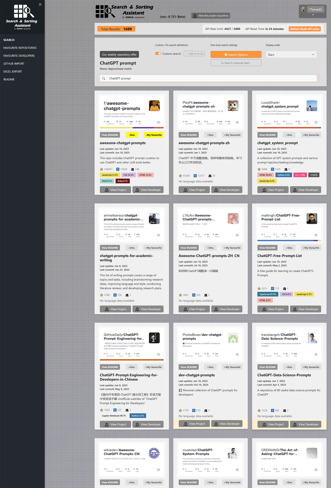

# Search & Sorting Assistant for GitHub repositories (ver.: 0.75 Beta)

## Important Notice
**This application is a beta version under active development.** It was initially intended for personal use and experimental purposes only, but I thought and modified it to make it available to others.  The application may contain bugs and some features may change over time as development progresses.

**The codebase available in the repository is currently only an open view for those interested until a final and stable state is reached.**

You can currently test the latest version of the application at this link: 
https://githubsearch.tomorgraphic.com

If you have any feedback or suggestions, please report them via the GitHub interface.

## Overview
The GitHub Repository Search Assistant is a web-based tool that helps users efficiently search and discover GitHub repositories and save them into favorite categories with custom annotations linked to their profile. The ability to display results in card format and add custom annotations is an enhanced option over the traditional GitHub interface, and may make it easier to recall features of some of our favorite repositories that are valuable to us in larger favorite lists later.

It also allows you to add favorite developers under your profile and add custom annotations to them.

To use the program, you need to log in to your own GitHub account via our interface with secure GitHub OAuth authentication, as this is the only way to ensure extended API access to the platform and proper connectivity to import existing data to this platform.

**These are additional features of the application:**
- Export your own lists to an Excel spreadsheet.
- Easy cloning of user's favorite and tracked repositories to this platform from their GitHub account.
- Add your own comments to all favorite repositories and developers.
- Custom card-based visualization interface.
- Weekly repository recommendations

Features planned and under development.......:
- More fast information display options
- Save your own lists as PDF.
- ............................

## Features

### Authentication
- **GitHub OAuth Authentication**: Secure login using your GitHub account
- Encrypted storage of the GitHub token in the database
- Personal settings and preferences saved to your profile
**Permissions requested for the GitHub API (currently read-only)**
- read:user: to read user data
- user:email: to retrieve email address
- repo: to retrieve repositories

### Display
- **nique style of data display organised on cards for quick management and overview of functions and information.**
- Responsive Design
- Works well on both desktop and mobile devices
- Modern Bootstrap-based user interface
- Sidebar navigation for easy access to all functions

### Repository Management
- Save your favorite repositories with a single click
- Quickly organize repositories into custom categories
- Add personal notes to repositories
- Detailed and quick display of repository statistics
- Easy import from repositories marked with an asterisk on GitHub

### Developer management
- Save favorite developers
- Add personal notes to your favorite developer
- View main aggregated data of your favorites
- View starred repositories of developers
- Listing developers' own repositories
- Easy import of developers tracked on GitHub

### Advanced Search System
- Predefined search topics
- Custom search terms
- Programming language filters
- Search in repository names, descriptions, and README files
- Specify fixed URLs for direct repository access

### Sorting and Filtering
- Sort by stars, update date, forks, or creation date
- Filter by programming language
- Filter by custom categories

### Import
- Import your GitHub starred repositories
- Import your GitHub following list
- Import your GitHub watched repositories

### Export Functionality
- Export favorite repositories to Excel
- Export favorite developers to Excel
- Export your own repositories to Excel
- Comprehensive formatting with multiple data sheets

### API Integration
- GitHub API integration with rate limit monitoring
- OAuth-based authentication for higher rate limits

## Technical Details
- Frontend: HTML5, CSS3, JavaScript, Bootstrap 5.3.2
- API: GitHub REST API integration
- Security: OAuth-based authentication
- Storage: Browser local/session storage for preferences

# User tutorial
## Login

  

## Simple text-based search

  

## Fixed term based search

  

## Favorite repositories management and categorization

  

## Managing favourite developers

  

## Import functions

  

## Export functions

  

